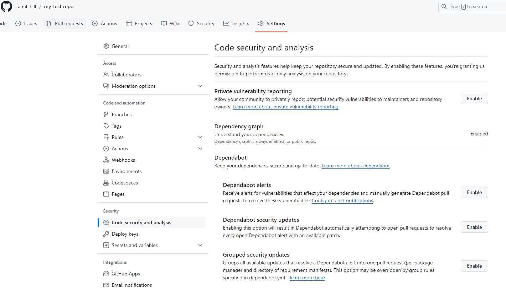
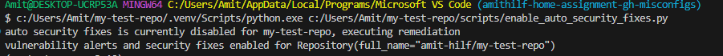
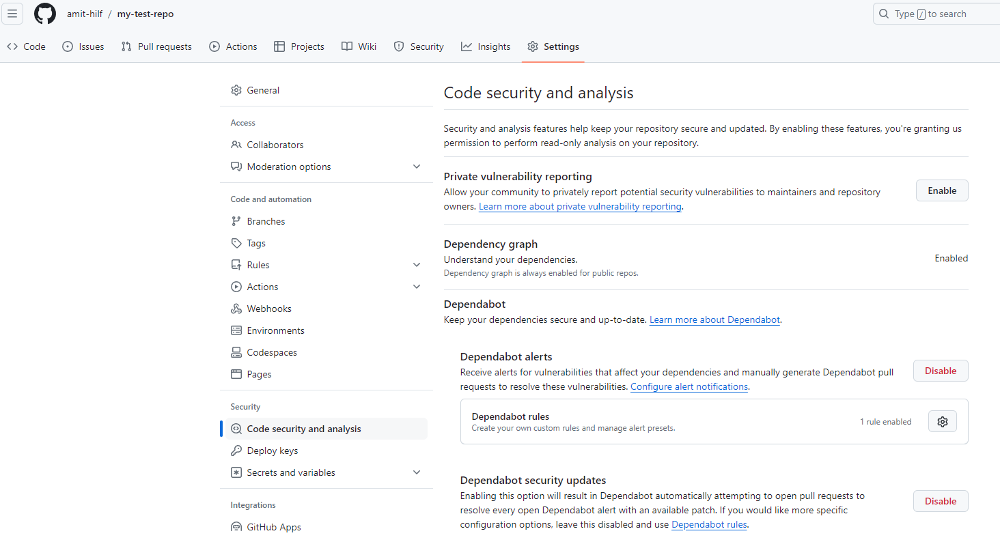
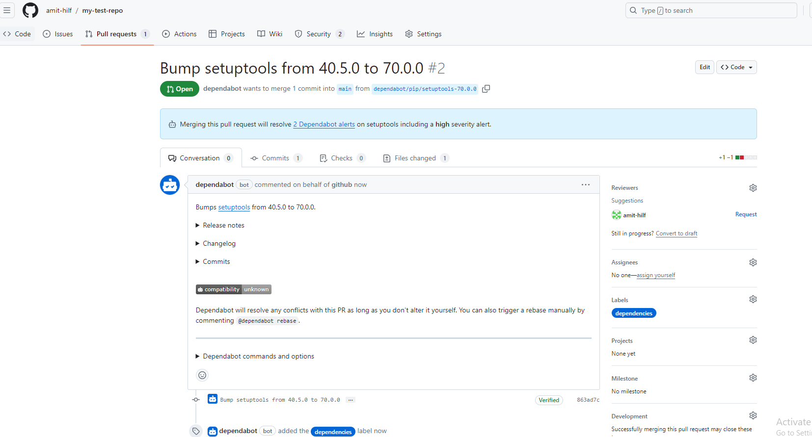

# GitHub Misconfigurations

## Misconfiguration #1 - Enabling vulnerability alerts & automated security fixes
1. As part of an application development phase, developers may require to install 3rd party packages to create new features and resolve issues. There is a risk that using an old version of a package could expose a vulnerability that attackers can exploit and effect the usage of the application.

2. When creating a new repository on GitHub, it is important to enable vulnerability alerts to raise the attention of the developers and release a fix accordingly. Moreover, GitHub's dependabot can automatically create pull requests to remediate the vulnerability.

3. In order to fix this configuration manually, a GitHub user with admin access to the repository would have to navigate to the main page of the repository and enter the settings page, click on the "Code security and analysis" section of the sidebar, and then click "Enable" near the "Dependabot alerts" section to enable the feature.

4. Changing this configuration may impact the work of the developers because they need to observe the vulnerability findings and validate that the pull requests that were created automatically don't cause any breaking changes.

### Usage
In order to use the script, you will have to set the following enviornment variables before running it:
`GITHUB_ACCESS_TOKEN`
`GITHUB_REPO_NAME`
`GITHUB_USER_NAME`

### Demonstration
My new repo (my-test-repo) was created without any vulnerability alerts and automatic fixes:

After running the script, you can see that now the settings are enabled:

I also pushed a 3rd party packages with a known exploit to a requirements file to validate dependabot will open a PR to fix it:

## Misconfiguration #2 - Validate repository secrets are up to date

1. Old secrets or unnecessary keys/tokens that have not been inspected in a while can be used to access sensitive information and an attacker who holds this data may gain access to your application.

2. It is recommended to refresh secret values regularly in order to minimize the risk of breach in case of an information leak.

3. In order to fix this configuration manually, a GitHub user with admin access to the repository would have to navigate to the main page of the repository, go to the settings tab, under the ‘Security’ title on the left, choose ‘Secrets and variables’, click ‘Actions’, sort secrets by ‘Last Updated’, regenerate every secret older than one year and add the new value to GitHub’s secret manager

4. Enabling this configuration should not have a direct impact on the daily work of developers , however they would need to take into account that the secret values may get refreshed from time to time and address it in their application.

## Infra

Serverless option - In order to transform the current approach to a more robust solution, I would first set up a scheduler component. the scheduler will be responsible for initiating the different misconfiguration scripts in different intervals or different triggers. For example, Amazon EventBridge Scheduler could be used to enable scheduling tasks and events at scale with different trigger scheduling patterns. an example for an event trigger could be if a new repo was created at the organization, so we would probably want to run some of the scripts immediately instead of waiting for the next interval.
In addition, I would create a pipeline for the scripts so they could be deployed as serverless functions. They could be deployed for example with AWS Lambda, which takes care of scale and availability automatically. The configurations to decide which script should run and what should be the interval per misconfiguration script could be stored at any key/value storage, for example even a single JSON file that contains a list with each script name, interval and additional triggers, this file can be stored at S3 and it will be updated as part of the deployment pipeline. Regarding monitoring the system, we could tools that are builtin the cloud computing platform we are using, for example in AWS we could utilize AWS CloudWatch to observe logs and create alerts for different events.
Mocked classes and a simple test with one of the misconfiguration scripts can be found under `tests` dir
